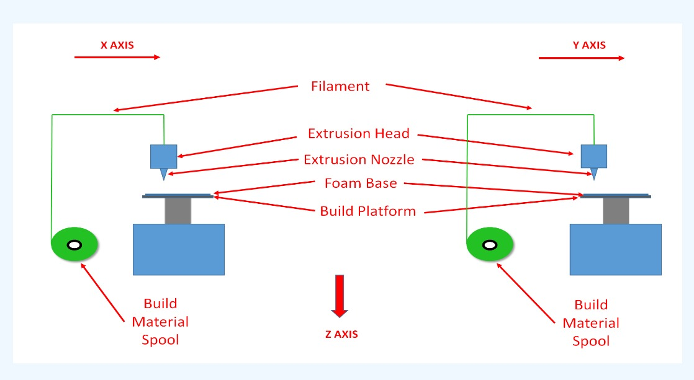

# Ex. No. 6 - SIMULATION OF FUSED DEPOSITION MODELING PROCESS

## DATE: 
## AIM:
### To simulate the Fused Deposition Modeling (FDM) process.

## REQUIREMENTS:
### System - Windows 7 or higher, 1 GB RAM.

## PROCEDURE:
### STEP 1: Click on 'Base'. Base and Build Platform will be displayed on the left side of the screen.
### STEP 2: Click on 'Extruder' then extruder and extruder nozzle will be displayed.
### STEP 3: Click on 'Material Spool' then material spool will be shown.
### STEP 4: Click on 'Filament' then filament will be added.
### STEP 5: Click on 'Start Process' to begin the process.
### STEP 6: After the process is complete click on 'Stop Process' to view product generated using FDM process.

## OUTPUT:

## Output:

## Base:

The base or print bed is the flat surface on which the object is built during the 3D printing process. It is usually a heated platform that provides stability and adhesion for the initial layers of the print.
 

## Extruder:

Extruder is a component that is responsible for heating,melting and depositing the filament in the print bed or base.It consist of motor,heating element and nozzle. The motor drives a gear or a wheel that grips the filament and pushes it into a heating chamber.Heated element is extruded through nozzle.
 

## Material spool:

Material spool is the cylindrical holder or container that holds the filament used for printing. The filament, which is typically in the form of a long, thin thread, is wound around the spool.
 

## Filament:

Filament is a long, thin strand of thermoplastic material that is fed into the 3D printer's extruder, melted, and deposited layer by layer to create a three-dimensional object.PLA (Polylactic Acid),ABS (Acrylonitrile Butadiene Styrene),PETG (Polyethylene Terephthalate Glycol) are some of the commonly used filament materials.
 

## Start process:

As per G-codes and M-codes ,the 3d printer starts to print the 3d model.The print bed is heated and ensures adhesion of base layer of the model.Then the filament from spool is pulled into extruder,where heating element heats filament and deposit it on the print bed.
 

## Stop process:

post processing is carried out to refine and enhance the final object.Once the print is complete, carefully remove the printed object from the build plate.The support material need to be removed from the model.

### Name: Sneha Basyal M
### Register Number: 212222240101

## Result:
### Thus the simulation on the FDM process is completed & prototyping process is studied.
